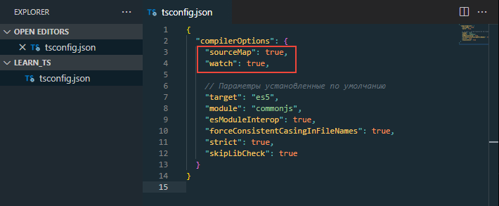
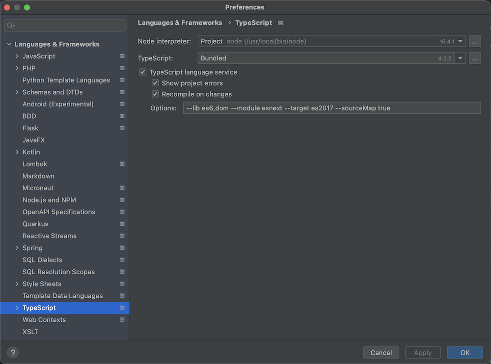

# Настройка окружения

Для изучения TypeScript нам потребуется настроить окружение для работы с ним:

1. Установить Node.js
2. Через менеджер пакетов `npm` глобально установить TypeScript
3. Настроить компилятор TypeScript 
   - Вариант 1 - tsconfig.json
   - Вариант 2 - компилятор JetBrains WebStorm/IDEA
4. Проверка настроек

### Установка Node.js
Переходим в раздел скачивания на официальном сайте <https://nodejs.org/en/download> и на вкладке `Current` выбираем версию под нужную нам ОС и скачиваем установщик.


После скачивания Node.js устанавливаем его с настройками по умолчанию (со всем соглашаемся и жмем кнопку «Next» &#128526;).


Для проверки, что «нода» установилась, откроем терминал или командную строку (в Windows) и напишем команду `node -v`. В случае успеха выведется информация об установленной версии Node.js.


### Установка TypeScript

Для установки TypeScript воспользуемся менеджером пакетов `npm`, который поставляется нам вместе с Node.js. Для этого откроем терминал и введем команду `npm install -g typescript`.


### Настройка компилятора TypeScript

Настроить автоматическую компиляцию можно TypeScript можно несколькими способами.
Выбирайте тот который удобнее

#### Вариант 1 - tsconfig

Создайте папку, в которой будете пробовать и изучать TS, например `learn_ts` и перейдите в нее.


Для создания конфигурационного файла выполните команду `tsc --init`.


В вашей папке появится файл `tsconfig.json`, в нем будет много «закомментированных» строк.


Все параметры и их описание можно посмотреть в [документации](https://www.typescriptlang.org/tsconfig).

Помимо параметров установленных по умолчанию предлагаю добавить еще пару, которые помогут нам в дальнейшем:

`sourceMap` включает создание исходной карты для ts-файлов, что позволит при отладке видеть исходный код, а не скомпилированный js.
`watch` позволит комплирировать ts-файлы автоматически при сохранении.



Так же рекомендую сразу указать опции паковки необходимые для темы работы с библиотеками
`"lib": ["es6", "dom"]`
`"module": "esnext"`
`"target": "es2017"`

#### Вариант 2 - компилятор JetBrains WebStorm/IDEA

`--lib es6,dom --module esnext --target es2017 --sourceMap true`



### Проверка настроек

Теперь давайте создадим необходимые файлы для дальнейшего изучения.

Файл index.html c базовой структурой и подключенным `script.js`.

```html
<!DOCTYPE html>
<html lang="en">
<head>
   <meta charset="UTF-8">
   <meta http-equiv="X-UA-Compatible" content="IE=edge">
   <meta name="viewport" content="width=device-width, initial-scale=1.0">
   <title>TypeScript</title>
</head>
<body>
   <script src="./script.js"></script>
</body>
</html>
```

... и собственно сам файл `script.ts` c таким вот содержимым, оно нам понадобится для проверки, что все работает корректно.

```JavaScript
console.log('Hello TypeScript!');


throw new Error();
```

Для запуска компиляции ts-файлов выполните в терминале команду `tsc` и увидите следующую информацию, которая означает что watcher изменений запущен.


Теперь откройте файл index.html в браузере и консоль.


В консоли выведется наше сообщение 'Hello TypeScript!' и ошибка с указанием строчки в нашем файле, где мы выбросили исключение.
При переходе по ссылке, мы увидим искомый script.ts и строчку, где произошла ошибка.

