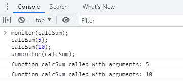

# Консоль
Самый базовый инструмент отладки - это консоль.     
Она предосталяет API для
* логирования разного уровня сложности и критичности ошибок,
* просмотра текущих значений переменных и состояния выполнения скрипта,
* просмотра результатов выполнения кода.

## Выполнение кода
```javascript
function calcSum(maxValue) {
    var sum = 0;
    for (var i = 0; i <= maxValue; ++i) {
        sum += i;
    }
    return sum;
}
calcSum(5);
```
Если выполнить приведенный код в консоли - будет выведен результат выполнения функции.

Очень удобно, что консоль хранит все вызовы кода и просто движениями стрелок вверх\вниз можно воспроизвести нужный код или найти свой скрипт автодополнением при вводе.


Любое из выведенных в консоль значений можно сохранить в глобальную переменную для проверки.
К примеру, при сохранении экземпляра объекта у вас будет возможность вызывать его методы или просматривать свойства.

В любой момент времени в консоли есть доступ:
1. К глобальным переменным и функциям,
2. К области видимости текущего блока кода, если установлена точка остановки.

## Логирование
```javascript
console.log('Инфо');
console.warn('Предупреждение');
console.error('Ошибка');
```
Помимо всего прочего консоль позволяет отфильтровать только необходимый уровень логирования в консоли:  


Если вам потребуется более четкая структура логирования консоли - всегда есть возможность сгруппировать сообщение по маркеру группы
```javascript
console.group();
```

При большой цепочке вызовов внутри вашего кода полезно каким образом мы попали в текущую точку выполнения.
Для этого достаточно выполнить команду:
```javascript
console.trace();
```

## Мониторинг

```javascript
monitor(calcSum);
calcSum(5);
calcSum(10);
unmonitor(calcSum);
```


Для DOM-элементов событий есть схожий функционал monitorEvents/unmonitorEvents.

## Замер времени выполнения
Для первичной оценки быстродействия своего кода можно включить замер времени выполнения кода.
Для этого достаточно в начале выполнения указать метку для блока кода
```javascript
console.time('sum');
calcSum(100);
console.timeEnd('sum');
```
Такой код выведет время в миллисекундах сколько браузер потратил времени на ввызов функции.

## Watch-выражения
В режиме реального времени в консоли можно отслеживать текущий результат любого выражения в зависимости от состояния программы


```javascript
console.clear();
```
