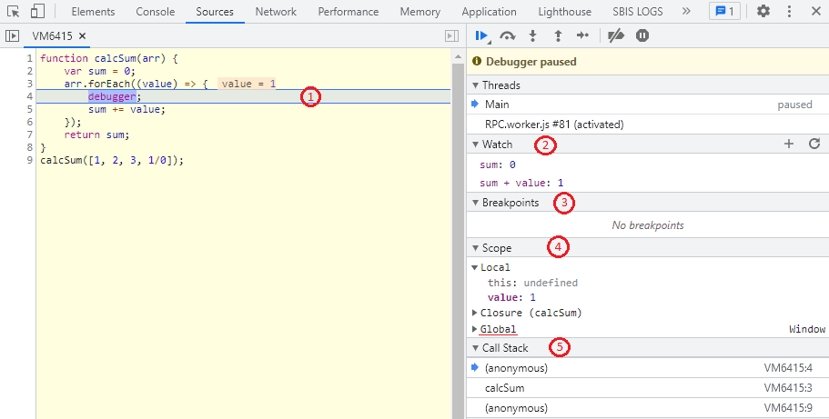
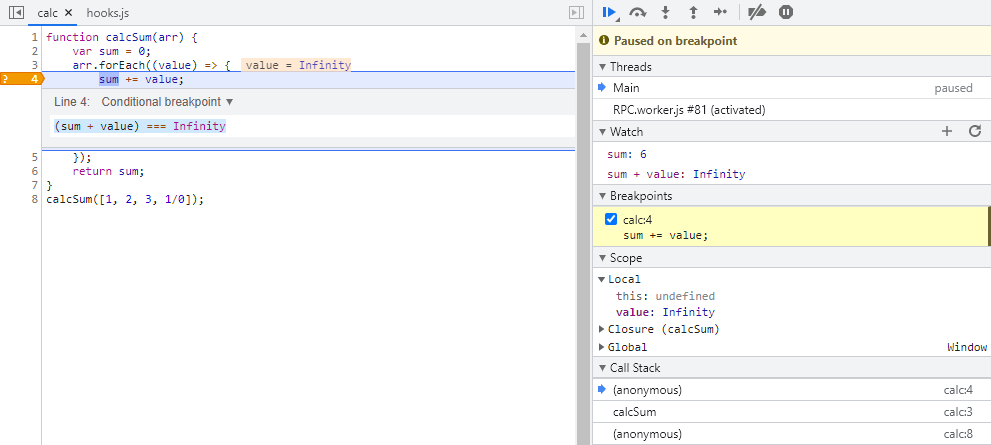

# Функциональные ошибки
Как мы уже говорили основная масса ошибок, с которыми в первую очередь придется столкнуться, это:
1. Синтаксические ошибки - ошибки в правильности синтаксиса.    
   Такие ошибки обычно легко исправить, проанализировав текст исключения.
2. Логические ошибки - ошибки непосредственно в алгоритмах программы.    
   Такие исправлять сложнее, чем синтаксические, поскольку никаких исключений явно не выдается и, как правило, приходится пощагово отлаживать ход выполнения.
   
При возникновении синтаксических ошибок в консоли браузера автоматически выводится ошибка и ее стек.
```javascript
function calcSum(arr) {
    var sum = 0;
    arr.forEach((value) => {
		sum1 += value;
	});
    return sum;
}
calcSum([1, 2, 3]);
```


Очень важно на этом этапе понять как понять источник ошибки, для этого внимательно рассмотрим стек исключения:
1. ReferenceError - это тип возникшего исключения.     
Подробнее о встроенных типах исключений можно прочитать в [документации](https://developer.mozilla.org/en-US/docs/Web/JavaScript/Reference/Global_Objects/Error).   
Конкретно этот тип ошибки означает, что в коде идет обращение к неопределенному значению.
2. Далее идет текст самого сообщения об ошибке ```sum1 is not defined```, т.е. не определена переменная ```sum1```.
3. Далее построчно отображен путь, которым мы пришли к исключению.

   В этом конкретном случае мы выполнили код в консоли, а не в каком-то файле скрипта, поэтому вместо названия файла выведено ```<anonymous>```.
4. И ```4:3``` означает, что исключение выстрелило на 4й строке, в 3м символе.

Если вы научитесь внимательно читать стек возникновения ошибки и изучите базовые встроенные типы ошибок - ориентироваться в проблемах вашего кода станет значительно проще.

```javascript
function calcSum(arr) {
    var sum = 0;
    arr.foreach((value) => {
		sum += value;
	});
    return sum;
}
calcSum([1, 2, 3]);
```


В этом примере мы видим уже другой тип ошибки - TypeError.

Но, даже если ваш код не падает с исключением - это не значит, что ошибок в нем нет.

Далее мы познакомимся со способами отладки уже логических ошибок, которые скорее всего ничего не выдают в консоль, но не дают вашему коду функционировать корректно.    
Для таких случаев наиболее мощным и удобным средством отладки является ***пошаговая отладка кода***.

## Breakpoints
Пошаговая отладка кода позволяет буквально пройти построчно весь процесс выполнения вашей программы.  
Рассмотрим простой пример функции, которая по идее должна выдавать сумму элементов массива.  
Но в коде есть ошибка, которая приводит к неожиданному результату.
```javascript
function calcSum(arr) {
    var sum = 0;
    arr.forEach((value) => {
        sum += value;
    });
    return sum;
}
calcSum([1, 2, 3, 1/0]); // Infinity
```

При выполнении этого кода в консоли вы получите значение ```Infinity```.
Если сходу непонятно в чем проблема - следует воспользоваться командой ```debugger;```.   
Она вызывает безусловную остановку выполнения кода в точке где указана команда. 

```javascript
//...
    arr.forEach((value) => {
        debugger;
        sum += value;
    });
//...
```



При срабатывании точки остановки в средствах отладки браузер предоставляет максимум информации в каждый момент времени:
1. Наглядно выделена синим строка остановки,
2. Справа в блоке Watch, по аналогии с консолью, можно добавлять по + новые вычисляемые значения.

   На каждом шаге браузер будет вычислять прописанное выражение.

   Даже если само выражение написано с ошибкой - браузер просто сообщит вам, что вычислить его не удалось, без падения программы.
3. Ниже выводится список точек остановок, который установил пользователь.   
   Точки остановки можно выключать, чтобы они оставались в памяти, но фактическая остановки на них не происходила.
4. Еще ниже выводятся все переменные в текущей области видимости, включая глобальный scope.
5. Самый нижний блок - это уже знакомый нам стек вызова функций.

Если мы пошагово пройдем код при помощи клавиш F10 и F11 - станет ясно, что последний элемент массива ```1/0``` как раз меняет переменную ```sum``` на значение ```Infinity```.

Также можно пошагово проходить ваш код с помощью кнопок в отладчике:


Команда  позволяет перевести отладчик в режим, когда любое исключение будет приводить к остановке выполнения программы.

Непосредственно точку остановки в браузере можно установить просто нажав на номер строки в вашем скрипте.
Помимо обычных точек остановки есть ***условные точки остановки***, они дают возможность настроить условие, при котором браузер остановит выполнение программы.


